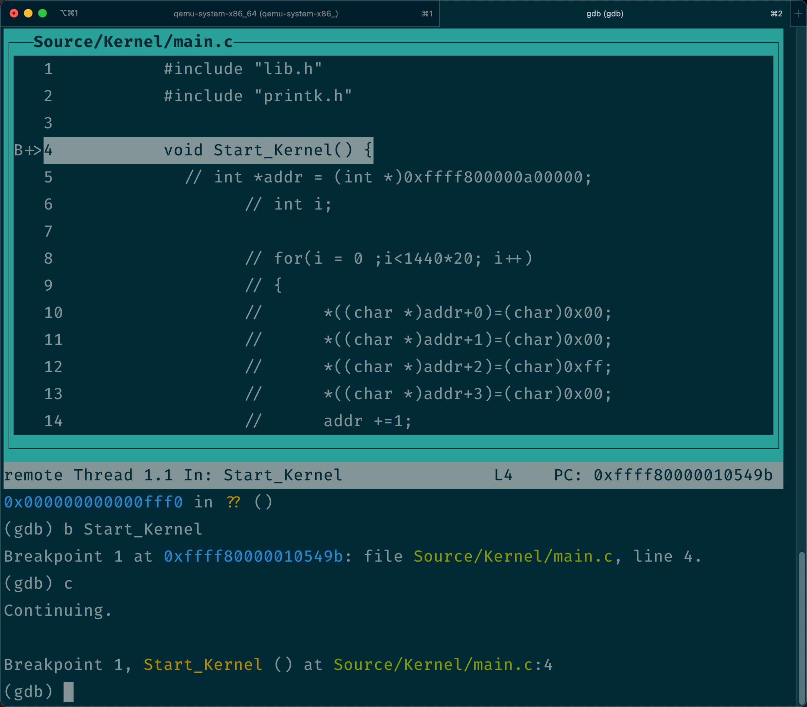

# Debug the kernel

之前，我们都是用汇编写代码，然后，在 Bochs 里用汇编调试。尽管并不那么方便，但问题还不大，毕竟要调试的汇编代码都是自己写的，还比较容易把这些代码和程序逻辑关联起来。但当我们开始用 C 之后，再用汇编调试就有些困难了。因此这一节，我们先来构建一个最简单的 C 入口函数，然后，介绍一种调试内核源代码的方法。

## 内核的 C 入口函数

在项目的 Source/Kernel 目录，新建一个 main.c，在其中加入下面的代码：

```c
void Start_Kernel() {
  while(1);
}
```

之所以用 `Start_Kernel` 这个名字，是因为在 head.S 中，我们压栈的地址就是这个函数，大家要改的话，把它们改成一致的就好了。至于这个函数要实现的各种功能，我们先无需关心，象征性的放一个死循环在这里就好了。这和之前在汇编代码里，我们用 `jmp $` 挂起系统的含义是类似的。

现在，有了 head.S 和 main.c，一个最简单的内核雏形就有了。我们可以先在源代码根目录执行 `make` 构建内核，再用 `make image` 把 loader 和内核镜像拷贝到软盘。

## 基于 GDB 的远程调试

接下来的问题就是，如何能实现源代码级的内核调试呢？为此我们可以借助另外两个工具，分别是 qemu 和 gdb。简单来说，qemu 内置了一个 gdb 服务端，它可以在虚拟机执行起来之后暂时挂起，等待来自 gdb 客户端的调试命令。然后，我们用一个 gdb 客户端连接上这个服务端，就可以实现“远程”代码调试了，把这个关系用图表示出来，就是这样的：

```shell
┌─────────────────────────────────────────┐
│ ┌─────────┐                     Qemu    │
│ │         │                             │
│ │   VM    │                             │
│ │         │────┐     ┌───────────────┐  │           ┌───────────────┐
│ │         │ listen──▶│  gdb server   │◀─┼─connect───│  gdb client   │
│ └─────────┘          └───────────────┘  │           └───────────────┘
└─────────────────────────────────────────┘
```

如果你使用 mac OS，可以直接用 `brew install qemu gdb` 安装这两个工具，如果是 Linux 就用对应发行版的包管理工具安装就好。安装完成后，我们打开两个终端，分别进入源代码的根目录。在一个终端执行：

```shell
qemu-system-x86_64 -vga std -drive file=Output/boot.img,format=raw,index=0,if=floppy -s -S
```

这样，qemu 就会启动并等待来自 gdb 的调试指令。然后，在另外一个终端，我们执行：

```shell
gdb --tui Output/system
```

这时，gdb 客户端就会打开一个文字版的调试界面，直接按回车，就可以进入命令行交互模式了。要注意的是，我们传递给 gdb 的参数是 `Output/system`，只有这个文件中才包含用于调试的符号信息，而 kernel.bin 中，我们已经用 objcopy 优化过了。

接下来，在 gdb 命令行，我们输入 `target remote localhost:1234`。这样，就可以让 gdb 客户端连接上“远程”的 qemu gdb 服务器。然后，执行 `b Start_Kernel`，如果一切顺利，gdb 就会给我们一个确认信息：

```shell
(gdb) b Start_Kernel
Breakpoint 1 at 0xffff80000010549b: file Source/Kernel/main.c, line 4.
```

最后，执行 `c` 命令，这会让 qemu 开始执行，等从 head.S 跳转到 `Start_Kernel` 的时候，gdb 就会断下来：



现在，我们就可以像调试一般程序一样，用 gdb 命令调试内核了。

## What's next

接下来，我们就要为内核开发第一个功能组件了。是什么呢？希望大家还记得，我们在 loader 中切换了显示模式之后，就无法在屏幕上显示内容了，这对于开发操作系统来说，是非常不方便的。因此，从下一节开始，我们的第一步，就是仿照 C 函数库的形式，为内核写一套打印信息的 API。
